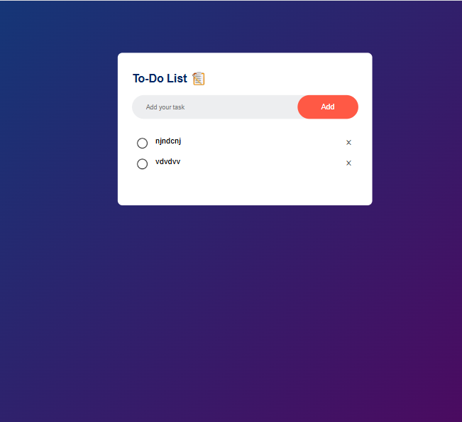

# 📝 To-Do List App

A simple and responsive **To-Do List Web App** built with **HTML, CSS, and JavaScript**.  
It allows users to add, check/uncheck, and delete tasks. Tasks are also stored in **localStorage**, so they persist even after refreshing the page.

---

## 🚀 Features
- ➕ **Add Tasks** – Quickly add new tasks using the input field or button.
- ✅ **Mark as Completed** – Click on a task to mark it as done (line-through style).
- ❌ **Delete Tasks** – Remove tasks using the close (×) button.
- 💾 **Local Storage** – Tasks are saved in the browser, so they remain after refresh.
- 📱 **Responsive Design** – Works on desktop and mobile screens.

---

## 🛠️ Tech Stack
- **HTML5**
- **CSS3 (with media queries for responsiveness)**
- ** JavaScript (DOM + localStorage)**

---

## screenshot

##Live link of my project
[click to view my live project](https://kkrishgupta.github.io/to-do-app);